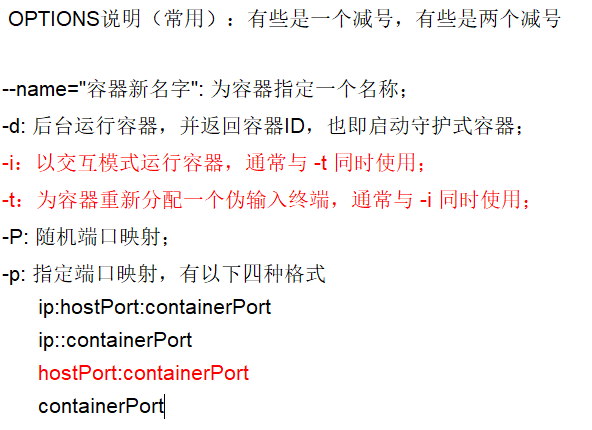
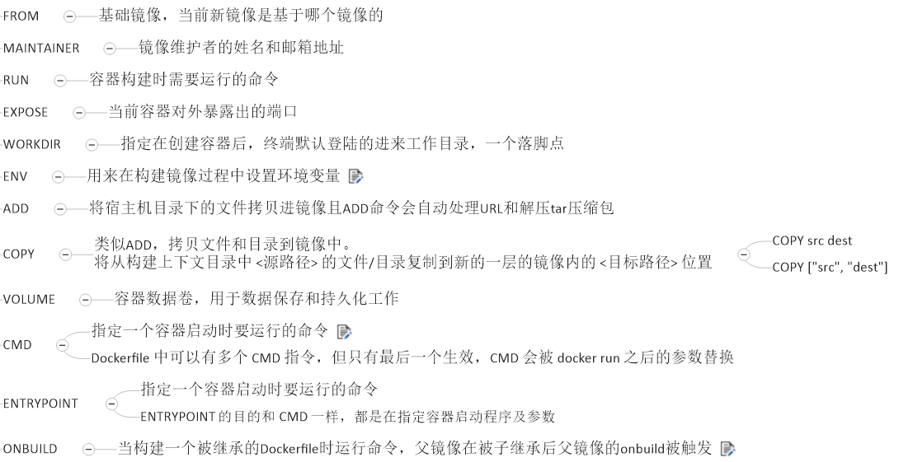

#  Docker

[TOC]

一款产品从开发到上线，从操作系统，到运行环境，再到应用配置。作为开发+运维之间的协作我们需要关心很多东西，这也是很多互联网公司都不得不面对的问题，特别是各种版本的迭代之后，不同版本环境的兼容，对运维人员都是考验
Docker之所以发展如此迅速，也是因为它对此给出了一个标准化的解决方案。
环境配置如此麻烦，换一台机器，就要重来一次，费力费时。很多人想到，能不能从根本上解决问题，软件可以带环境安装？也就是说，安装的时候，把原始环境一模一样地复制过来。开发人员利用 Docker 可以消除协作编码时“在我的机器上可正常工作”的问题。


之前在服务器配置一个应用的运行环境，要安装各种软件，就拿尚硅谷电商项目的环境来说吧，Java/Tomcat/MySQL/JDBC驱动包等。安装和配置这些东西有多麻烦就不说了，它还不能跨平台。假如我们是在 Windows 上安装的这些环境，到了 Linux 又得重新装。况且就算不跨操作系统，换另一台同样操作系统的服务器，要移植应用也是非常麻烦的。

传统上认为，软件编码开发/测试结束后，所产出的成果即是程序或是能够编译执行的二进制字节码等(java为例)。而为了让这些程序可以顺利执行，开发团队也得准备完整的部署文件，让维运团队得以部署应用程式，开发需要清楚的告诉运维部署团队，用的全部配置文件+所有软件环境。不过，即便如此，仍然常常发生部署失败的状况。Docker镜像的设计，使得Docker得以打破过去「程序即应用」的观念。透过镜像(images)将作业系统核心除外，运作应用程式所需要的系统环境，由下而上打包，达到应用程式跨平台间的无缝接轨运作。

## 简介

Docker是基于Go语言实现的云开源项目。
Docker的主要目标是“Build，Ship and Run Any App,Anywhere”，也就是通过对应用组件的封装、分发、部署、运行等生命周期的管理，使用户的APP（可以是一个WEB应用或数据库应用等等）及其运行环境能够做到***“一次封装，到处运行”。***

Linux 容器技术的出现就解决了这样一个问题，而 Docker 就是在它的基础上发展过来的。将应用运行在 Docker 容器上面，而 Docker 容器在任何操作系统上都是一致的，这就实现了跨平台、跨服务器。只需要一次配置好环境，换到别的机子上就可以一键部署好，大大简化了操作


## 容器虚拟化技术

由于前面虚拟机存在这些缺点，Linux 发展出了另一种虚拟化技术：Linux 容器（Linux Containers，缩写为 LXC）。
Linux 容器不是模拟一个完整的操作系统，而是对进程进行隔离。有了容器，就可以将软件运行所需的所有资源打包到一个隔离的容器中。容器与虚拟机不同，不需要捆绑一整套操作系统，只需要软件工作所需的库资源和设置。系统因此而变得高效轻量并保证部署在任何环境中的软件都能始终如一地运行。


比较了 Docker 和传统虚拟化方式的不同之处：

+ 传统虚拟机技术是虚拟出一套硬件后，在其上运行一个完整操作系统，在该系统上再运行所需应用进程；
+ 而容器内的应用进程直接运行于宿主的内核，容器内没有自己的内核，而且也没有进行硬件虚拟。因此容器要比传统虚拟机更为轻便。

* 每个容器之间互相隔离，每个容器有自己的文件系统 ，容器之间进程不会相互影响，能区分计算资源。

## Docker安装

+ CentOS Docker 安装
  Docker支持以下的CentOS版本：
  CentOS 7 (64-bit)
  CentOS 6.5 (64-bit) 或更高的版本

+ 前提条件
  目前，CentOS 仅发行版本中的内核支持 Docker。
  Docker 运行在 CentOS 7 上，要求系统为64位、系统内核版本为 3.10 以上。
  Docker 运行在 CentOS-6.5 或更高的版本的 CentOS 上，要求系统为64位、系统内核版本为 2.6.32-431 或者更高版本。

+ 查看自己的内核
  uname命令用于打印当前系统相关信息（内核版本号、硬件架构、主机名称和操作系统类型等）。

  

+ 查看已安装的CentOS版本信息（CentOS6.8有，CentOS7无该命令）

  

### 安装

> yum install -y yum-utils
>
> yum-config-manager     --add-repo     https://download.docker.com/linux/centos/docker-ce.repo
>
> yum install docker-ce -y
>
> systemctl start docker
>
> docker info

+ vim /etc/docker/daemon.json

  ```json
  {
    "graph": "/data/docker",
    "storage-driver": "overlay2",
    "insecure-registries": ["registry.access.redhat.com","quay.io"],
    "registry-mirrors": ["https://q2gr04ke.mirror.aliyuncs.com"],
    "bip": "172.52.26.0/24", // 与宿主机ip后两位相同
    "exec-opts": ["native.cgroupdriver=systemd"],
    "log-opts": {"max-size":"32M", "max-file":"2"},
    "live-restore": true
  }
  ```

  


### docker run hello-world


## 原理

(1)docker有着比虚拟机更少的抽象层。由亍docker不需要Hypervisor实现硬件资源虚拟化,运行在docker容器上的程序直接使用的都是实际物理机的硬件资源。因此在CPU、内存利用率上docker将会在效率上有明显优势。

(2)docker利用的是宿主机的内核,而不需要Guest OS。因此,当新建一个容器时,docker不需要和虚拟机一样重新加载一个操作系统内核。仍而避免引寻、加载操作系统内核返个比较费时费资源的过程,当新建一个虚拟机时,虚拟机软件需要加载Guest OS,返个新建过程是分钟级别的。而docker由于直接利用宿主机的操作系统,则省略了返个过程,因此新建一个docker容器只需要几秒钟。


## 架构图


### 基本组成

#### 镜像

Docker 镜像（Image）就是一个只读的模板。镜像可以用来创建 Docker 容器，一个镜像可以创建很多容器。


#### 容器


Docker 利用容器（Container）独立运行的一个或一组应用。容器是用镜像创建的运行实例。

它可以被启动、开始、停止、删除。每个容器都是相互隔离的、保证安全的平台。

可以把容器看做是一个简易版的 Linux 环境（包括root用户权限、进程空间、用户空间和网络空间等）和运行在其中的应用程序。

容器的定义和镜像几乎一模一样，也是一堆层的统一视角，唯一区别在于容器的最上面那一层是可读可写的。

#### 仓库

> docker login docker.io
>
> # 在命令行搜索镜像
>
> docker search nginx 

仓库（Repository）是集中存放镜像文件的场所。
仓库(Repository)和仓库注册服务器（Registry）是有区别的。仓库注册服务器上往往存放着多个仓库，每个仓库中又包含了多个镜像，每个镜像有不同的标签（tag）。

仓库分为公开仓库（Public）和私有仓库（Private）两种形式。
最大的公开仓库是 Docker Hub(https://hub.docker.com/)，
存放了数量庞大的镜像供用户下载。国内的公开仓库包括阿里云 、网易云 等

### 总结

需要正确的理解仓储/镜像/容器这几个概念:

Docker 本身是一个容器运行载体或称之为管理引擎。我们把应用程序和配置依赖打包好形成一个可交付的运行环境，这个打包好的运行环境就似乎 image镜像文件。只有通过这个镜像文件才能生成 Docker 容器。image 文件可以看作是容器的模板。Docker 根据 image 文件生成容器的实例。同一个 image 文件，可以生成多个同时运行的容器实例。

*  image 文件生成的容器实例，本身也是一个文件，称为镜像文件。

*  一个容器运行一种服务，当我们需要的时候，就可以通过docker客户端创建一个对应的运行实例，也就是我们的容器

* 至于仓储，就是放了一堆镜像的地方，我们可以把镜像发布到仓储中，需要的时候从仓储中拉下来就可以了。

## Docker命令

### 帮助命令

+ docker version
+ docker info
+ docker --help

### 镜像命令


> docker tag 7731472c3f2a docker.io/zangyang/alpine:v3.10.3
>
> ### #推到dockerhub
>
> docker push docker.io/zangyang/alpine:v3.10.3


### 容器命令


> docker run --name MyWordPress --link db:mysql -p 8080:80 -d wordpress

> 进入容器中进行交互式操作
>
> docker exec -it db /bin./bash

+ 新建启动容器命令中的option

  

+ 列出正在运行的容器的option

  

+ 重新进入已经退出的容器

  > docker attach 容器id

  

## Docker镜像

### UnionFS（联合文件系统）

UnionFS（联合文件系统）：Union文件系统（UnionFS）是一种分层、轻量级并且高性能的文件系统，它支持对文件系统的修改作为一次提交来一层层的叠加，同时可以将不同目录挂载到同一个虚拟文件系统下(unite several directories into a single virtual filesystem)。Union 文件系统是 Docker 镜像的基础。镜像可以通过分层来进行继承，基于基础镜像（没有父镜像），可以制作各种具体的应用镜像。

特性：一次同时加载多个文件系统，但从外面看起来，只能看到一个文件系统，联合加载会把各层文件系统叠加起来，这样最终的文件系统会包含所有底层的文件和目录

### 原理

 Docker镜像加载原理：
   docker的镜像实际上由一层一层的文件系统组成，这种层级的文件系统UnionFS。
bootfs(boot file system)主要包含bootloader和kernel, bootloader主要是引导加载kernel, Linux刚启动时会加载bootfs文件系统，在Docker镜像的最底层是bootfs。这一层与我们典型的Linux/Unix系统是一样的，包含boot加载器和内核。当boot加载完成之后整个内核就都在内存中了，此时内存的使用权已由bootfs转交给内核，此时系统也会卸载bootfs。

rootfs (root file system) ，在bootfs之上。包含的就是典型 Linux 系统中的 /dev, /proc, /bin, /etc 等标准目录和文件。rootfs就是各种不同的操作系统发行版，比如Ubuntu，Centos等等。 

 
 平时我们安装进虚拟机的CentOS都是好几个G，为什么docker这里才200M？？

对于一个精简的OS，rootfs可以很小，只需要包括最基本的命令、工具和程序库就可以了，因为底层直接用Host的kernel，自己只需要提供 rootfs 就行了。由此可见对于不同的linux发行版, bootfs基本是一致的, rootfs会有差别, 因此不同的发行版可以公用bootfs。

### 提交镜像

+ 启动tomcat

  > docker run -it -p 8888:8080 tomcat

  


:japanese_ogre: 很奇葩的问题,需要注意一下，哈哈哈哈

默认访问的index.jsp应该在webapps 但是从阿里云镜像拉下来的tomcat镜像文件里出现两个文件夹，但是默认的内容放在webapps.dist里 这里需要重命名一下把webapps.dist改成webapps


+ commit

  > docker commit -a="ntuzy" -m="del tomcat docs" 容器id ntu/mytomcat:1.2


## Docker容器数据卷

先来看看Docker的理念：
*  将运用与运行的环境打包形成容器运行 ，运行可以伴随着容器，但是我们对数据的要求希望是持久化的
*  容器之间希望有可能共享数据


Docker容器产生的数据，如果不通过docker commit生成新的镜像，使得数据做为镜像的一部分保存下来，
那么当容器删除后，数据自然也就没有了。

为了能保存数据在docker中我们使用卷。

### 作用（持久化+数据共享）

卷就是目录或文件，存在于一个或多个容器中，由docker挂载到容器，但不属于联合文件系统，因此能够绕过Union File System提供一些用于持续存储或共享数据的特性：

 卷的设计目的就是数据的持久化，完全独立于容器的生存周期，因此Docker不会在容器删除时删除其挂载的数据卷

特点：

+ 数据卷可在容器之间共享或重用数据
+ 卷中的更改可以直接生效
+ 数据卷中的更改不会包含在镜像的更新中
+ 数据卷的生命周期一直持续到没有容器使用它为止

### 容器内添加

+ 直接命令添加

  > docker run -it -v /宿主机绝对路径目录:/容器内目录      镜像名

  

  

+ DockerFile添加

  

  > docker build -f /mydocker/Dockerfile -t ntuzy/centos


### 数据卷容器-容器相互继承

命名的容器挂载数据卷，其它容器通过挂载这个(父容器)实现数据共享，挂载数据卷的容器，称之为数据卷容器

> docker run -it --name dc02 --volumes-from dc01 zzyy/centos


## DockerFile

Dockerfile是用来构建Docker镜像的构建文件，是由一系列命令和参数构成的脚本。

+ 编写DockerFile文件
+ docker build
+ docker run

```shell
FROM scratch
MAINTAINER The CentOS Project <cloud-ops@centos.org>
ADD c68-docker.tar.xz /
LABEL name="CentOS Base Image" \
    vendor="CentOS" \
    license="GPLv2" \
    build-date="2016-06-02"

# Default command
CMD ["/bin/bash"]
```

### 基础内容

+ 每条保留字指令都必须为大写字母且后面要跟随至少一个参数
+ 指令按照从上到下，顺序执行
+ #表示注释
+ 每条指令都会创建一个新的镜像层，并对镜像进行提交

### 执行流程

+ docker从基础镜像运行一个容器
+ 执行一条指令并对容器作出修改
+ 执行类似docker commit的操作提交一个新的镜像层
+ docker再基于刚提交的镜像运行一个新容器
+ 执行dockerfile中的下一条指令直到所有指令都执行完成

### 保留字



### 自定义镜像

> docker build -f Dockerfile -t mycentos:1.3 .


+ dockerfile

  ```shell
  FROM centos
  MAINTAINER zzyy<zzyy167@126.com>
   
  ENV MYPATH /usr/local
  WORKDIR $MYPATH
   
  RUN yum -y install vim
  RUN yum -y install net-tools
   
  EXPOSE 80
   
  CMD echo $MYPATH
  CMD echo "success--------------ok"
  CMD /bin/bash
  ```

### CMD 与 ENTRYPOINT

说白了就是追加与不追加的关系

cmd 如果在后面继续 执行cmd命令 就会覆盖之前的所有cmd命令

entrypoint 就是在前面的命令后面追加命令 不会覆盖之前的命令


### 自建tomcat9镜像

+ 创建Dockerfile目录用来存放形成镜像的一些必要文件

  > mkdir mkdir -p /ntuzy/mydockerfile/tomcat9

+ 在目录中创建文件

+ 将创建镜像需要的文件放到文件夹中

  

+ 新建Dockerfile

  ```shell
  FROM         centos
  MAINTAINER    ntuzy<ntuzy@outlook.com>
  #把宿主机当前上下文的c.txt拷贝到容器/usr/local/路径下
  COPY c.txt /usr/local/cincontainer.txt
  #把java与tomcat添加到容器中
  ADD jdk-8u171-linux-x64.tar.gz /usr/local/
  ADD apache-tomcat-9.0.8.tar.gz /usr/local/
  #安装vim编辑器
  RUN yum -y install vim
  #设置工作访问时候的WORKDIR路径，登录落脚点
  ENV MYPATH /usr/local
  WORKDIR $MYPATH
  #配置java与tomcat环境变量
  ENV JAVA_HOME /usr/local/jdk1.8.0_171
  ENV CLASSPATH $JAVA_HOME/lib/dt.jar:$JAVA_HOME/lib/tools.jar
  ENV CATALINA_HOME /usr/local/apache-tomcat-9.0.8
  ENV CATALINA_BASE /usr/local/apache-tomcat-9.0.8
  ENV PATH $PATH:$JAVA_HOME/bin:$CATALINA_HOME/lib:$CATALINA_HOME/bin
  #容器运行时监听的端口
  EXPOSE  8080
  #启动时运行tomcat
  # ENTRYPOINT ["/usr/local/apache-tomcat-9.0.8/bin/startup.sh" ]
  # CMD ["/usr/local/apache-tomcat-9.0.8/bin/catalina.sh","run"]
  CMD /usr/local/apache-tomcat-9.0.8/bin/startup.sh && tail -F /usr/local/apache-tomcat-9.0.8/bin/logs/catalina.out
  ```

+ 构建(别忘了最后有一个点  **.**  ) 

  > docker build -t ntuzytomcat9 .

+ 运行

  映射地址 将容器中的地址映射到本机上webapps和logs

  > docker run -d -p 9080:8080 --name myt9 -v 
  >
  > /ntuzy/mydockerfile/tomcat9/test:/usr/local/apache-tomcat-9.0.8/webapps/test -v /ntuzy/mydockerfile/tomcat9/tomcat9logs/:/usr/local/apache-tomcat-9.0.8/logs --privileged=true ntuzytomcat9

## 部署web项目

根据刚才映射，容器中webapps/test(test项目名)转为本机的tomcat9/test


+ 测试

  

### 阿里云上传本地镜像

+ 创建镜像仓库


+ 上传阿里云

```shell
$ sudo docker login --username=562018301@qq.com registry.cn-hangzhou.aliyuncs.com
$ sudo docker tag [ImageId] registry.cn-hangzhou.aliyuncs.com/ntuzy/mycentos:[镜像版本号]
$ sudo docker push registry.cn-hangzhou.aliyuncs.com/ntuzy/mycentos:[镜像版本号]
```


+ pull

  > sudo docker pull registry.cn-hangzhou.aliyuncs.com/ntuzy/mycentos:[镜像版本号]